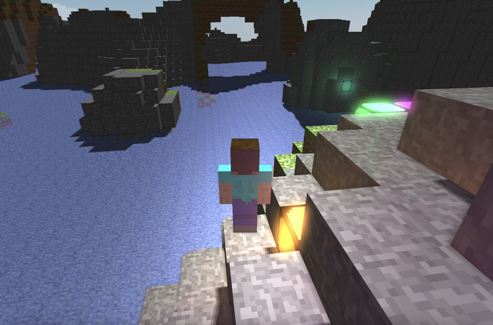

# Just Another Minecraft Clone
This is just another minecraft clone because the world clearly needed another one. In this clone, classical rendering techniques are explored - implemented in Metal and C++.

**NOTE: Currently the only supported graphics API is Metal, so this project will only compile/work on macOS. OpenGL support is planned.**


## Features
In this project you can find:
- Deferred Shading
- Screen-space ambient occlusion (SSAO)
- Cascaded Shadow Maps
- Transparent Blocks
- Light-source (point-light) blocks
- Bloom
- Skybox
- Multi-threaded chunk generation/meshing
- Animated Skeletal Meshes
- Greedy Voxel Meshing
- Infinite terrain generation (w/ Perlin noise)
- AABB/Quad/Line collision
- Line batching system (for 3D debugging)

## Setup
**Currently only macOS is supported.**
To setup and run this program, clone the repo and submodules, then build using cmake in a separate build directory.
```
git clone https://github.com/RedYaksha/JustAnotherMinecraftClone.git
cd JustAnotherMinecraftClone
git submodule update
mkdir build
cd build
cmake ..
cmake --build .
```
When running the program, the working directory should be where the final executable was built to. (so assets and shaders can be found).
```
cd bin
./JustAnotherMinecraftClone
```

## Future Work (in no particular order)
- UI System
- Caves (w/ Perlin Worms)
- Modern OpenGL Backend
- Sound
- Mobs

### Building .metal source files
For those that are interested: this may also serve as an example on how to setup a CMake project to compile your Metal Shading Language source files, merge them into a .metallib, and use them during runtime. 
See [Src/Shaders/Metal/CMakeLists.txt](Src/Shaders/Metal/CMakeLists.txt) and [Src/Engine.mm](Src/Engine.mm).


